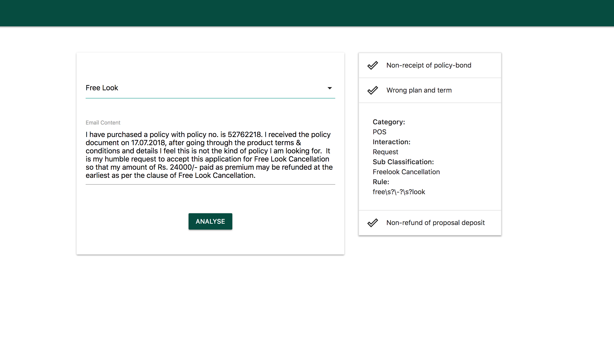

# FlaskApplicationStarter
Flask Application Using Docker Running on Uwsgi for NLP Engine

- application runs on docker
- uses uwsgi along with flask

### Setup Docker on Ubuntu 16.04
- References
  - [Installation for Ubuntu 16.04](https://docs.docker.com/install/linux/docker-ce/ubuntu/)
  - [Post-installation instructions for Ubuntu](https://docs.docker.com/install/linux/linux-postinstall/)
  - [Install Docker Compose](https://docs.docker.com/compose/install/)

```bash
# remove older versions if any
sudo apt-get remove docker docker-engine docker.io

# update apt package index
sudo apt-get update

# package for https 
sudo apt-get install \
    apt-transport-https \
    ca-certificates \
    curl \
    software-properties-common
    
# add docker GPG key
curl -fsSL https://download.docker.com/linux/ubuntu/gpg | sudo apt-key add -

# add repository
sudo add-apt-repository \
   "deb [arch=amd64] https://download.docker.com/linux/ubuntu \
   $(lsb_release -cs) \
   stable"
   
# install docker-ce
sudo apt-get update
sudo apt-get install docker-ce

# verify docker installation
sudo docker run hello-world

# add docker user
sudo groupadd docker

# add user to docker group
sudo usermod -aG docker $USER

# logout and log back in before running
docker run hello-world

# install docker compose
sudo curl -L https://github.com/docker/compose/releases/download/1.22.0/docker-compose-$(uname -s)-$(uname -m) -o /usr/local/bin/docker-compose
sudo chmod +x /usr/local/bin/docker-compose

# check compose installation
docker-compose --version
```

### Clone Repository
```bash
git clone https://github.com/shams-sam/FlaskApplicationStarter.git
```

### Build
```bash
cd FlaskApplicationStarter
cp .env.sample .env
docker-compose build
```

### Run in detached mode
```bash
docker-compose up -d
```

### Run in Tmux
```bash
tmux new -s app
docker-compose up
ctrl-b d
```


### Test Flask
- http://localhost/flask_status should return 200 OK
- base url at http://localhost/nlp

### Stop
```bash
docker-compose down
```

### Debug
```bash
# run in verbose mode
docker-compose up

# list the containers running
docker-compose ps

# probing inside the container
docker exec -it <container-name> bash
```

### Remove Docker and Docker Compose
```bash
pip uninstall docker-compose
sudo apt-get purge docker-ce
```

### Screenshot

